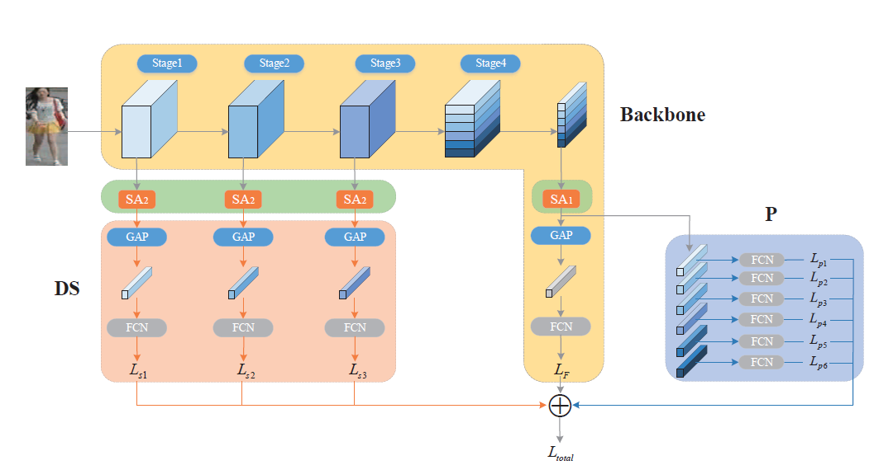

# 之江杯(复赛)---行人多目标跟踪方法运行代码 MUST
---
### 依赖项

### 代码环境配置运行

- 下载ReID模型相关参数，链接请点击[链接](https://pan.baidu.com/s/1sROOxFIgQYqrZA0CvLuMUA)。

1. 将net_last.pth文件放置在pysot\mot_zj\MUST_ASSO\model\ft_ResNet50文件夹种；
2. 将checkpoint.pth.tar文件放置在pysot\mot_zj\MUST_ASSO\Spatial_Attention\logs\cuhk_detected文件夹中；
3. 将alex_model.pth文件放置在\pysot\mot_zj\MUST_ASSO\Spatial_Attention文件夹中。
- 运行根目录demo.py文件

### 方案说明与算法原理
##### 成绩运行时间说明
- 目标检测：b1, b2, b3, b5(yolov3):共计约2h（1050Max-q, 16G）
- 目标检测：b4(keypoints-Mask-R-CNN):约4h（1080Ti*1, 64G）
- 基于检测结果输出跟踪提交结果：共计约5h（1080Ti*1, 64G）

##### 算法原理
YOLOv3、keypoints-Mask-R-CNN、SiamsRPN, ReID[9] 可以根据参考文献内容。

###### 算法框架

### 数据和预训练权重保存
##### 训练数据
本次比赛用到的数据集主要有两类，行人检测数据集citypersons（包含网上搜索自标注的50张图片）和行人重识别的cuhk数据集
使用方法：
将下载的文件夹放入相应的文件夹中，如citypersons连接中包含images的压缩包，可替代仓库中的dataset中的cityperson中的images文件夹
连接如下
- [citypersons(rar)](https://pan.baidu.com/s/1yui64WJi92-bOh49qufCzg)
- [cuhk](https://pan.baidu.com/s/17mPbmo4NdFmx1pDgUC1msg)

##### 预训练权重
预训练权重保存在weights目录下
- [YOLOv3预训练（用于训练行人检测的预训练Darknet53模型）](https://pan.baidu.com/s/1_5Rwvc8clnCb44z0R2o70Q)
- [yolov3用于行人检测的权重](https://pan.baidu.com/s/1KsQPTdgABt_rRLn7H_AA8w)
- [keypoints-Mask-R-CNN](https://pan.baidu.com/s/1a8A6xVNuuo6Zr3cc3DbB2Q)
- [pysot]()

### 训练
#### Yolo检测网络训练
<pre><code> python3 detector/yolov3/train.py --multi-scale
</code></pre> 

#### ReID网络训练
<pre><code>ReID 部分我们使用了cuhk数据集，这个数据集有两个部分cuhk-labelled and cuhk-detected, 最后使用了cuhk-labelled的训练结果
for cuhk-labelled 
python pysot/ReID/main.py -d cuhk -b 20 -j 4 --epochs 100 --log ./logs/cuhk_labeled/ --step-size 40 --data data/cuhk03-np/labeled
for cuhk-detected
python pysot/ReID/main.py -d cuhk -b 20 -j 4 --epochs 100 --log ./logs/cuhk_detected/ --step-size 40 --data-dir data/cuhk03-np/labeled
</code></pre>

##### 其他
本次比赛中，检测算法使用了[YOLOv3](https://github.com/ultralytics/yolov3)和[keypoints-Mask-R-CNN](https://github.com/chrispolo/Keypoints-of-humanpose-with-Mask-R-CNN)两种方法。

其中，YOLOv3在COCO预训练的基础上进行了重新训练，keypoints-Mask-R-CNN直接使用了作者提供的预训练模型。

为了增强黑夜检测效果的性能，b4采用keypoints-Mask-R-CNN，其他视频检测应用YOLOv3。

### 生成每帧图像和检测保存路径
<pre><code>python detector/to_img.py
</code></pre>

### 目标检测及后处理
<pre><code>FOR b1,b2,b3,b5: python detector/YOLO/video_demo.py
FOR b4: python detector/Mask_R_CNN_Keypoints/video_demo.py
python detector/det_process.py
</code></pre>

### 目标跟踪
##### SiamRPN
使用pysot框架完成单个行人目标的跟踪

### *特别说明*
由于最后提交日时间问题，b3提交结果为level_1阶段应用提交的ECO跟踪算法。复赛的前几次结果也是应用ECO算法提交，即b3与9.12日提交结果一致。

### 参考文献及程序来源
[1] https://github.com/STVIR/pysot

[2] Li B , Wu W , Wang Q , et al. SiamRPN++: Evolution of Siamese Visual Tracking with Very Deep Networks[J]. 2018.

[4] Zhu, J., Yang, H., Liu, N., Kim, M., Zhang, W., Yang, M.: Online Multi-Object Tracking with Dual Matching Attention Networks. In: ECCV (2018)

[5] Redmon J , Farhadi A . YOLOv3: An Incremental Improvement. 2018.

[6] Wang H , Fan Y , Wang Z , et al. Parameter-Free Spatial Attention Network for Person Re-Identification[J]. 2018.

[7] https://github.com/chrispolo/Keypoints-of-humanpose-with-Mask-R-CNN

[8] https://github.com/ultralytics/yolov3

[9] Wang, Haoran, et al. "Parameter-Free Spatial Attention Network for Person Re-Identification." arXiv preprint arXiv:1811.12150 (2018).

